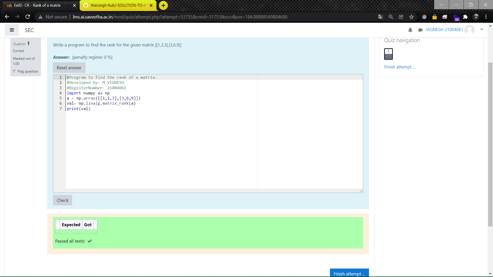

# RANK-OF-A-MATRIX
## Aim:
To write a python program to find the rank of a matrix
## Equipment’s required:
1. 	Hardware – PCs
2. 	Anaconda – Python 3.7 Installation / Moodle-Code Runner
## Algorithm:
### Step 1: 
Import the numpy module to use the built-in functions for calculation
### Step 2: 
Get the matrix form from user using 
np.array()
### Step 3: 
Using the np.linalg.matrix_rank(), we can find the rank of the given matrix.
### Step 4: 
End the program
## Program:
~~~
#Program to find the rank of a matrix.
#Developed by: M VIGNESH
#RegisterNumber: 21004061
import numpy as np
a = np.array([[1,2,3],[3,6,9]])
val= np.linalg.matrix_rank(a)
print(val)
~~~
## Output:

## Result:
Thus the rank for the given matrix is successfully solved by  using a python program.

